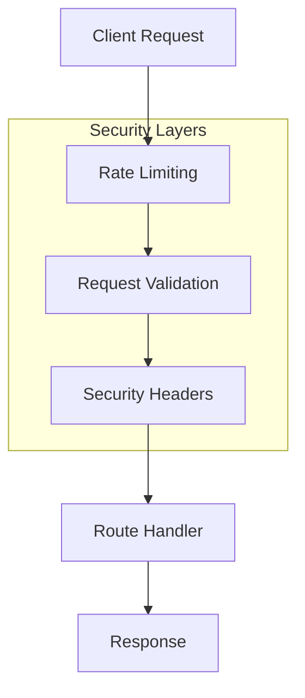

# Security Overview

## Architecture

MyCrypto implements a multi-layered security approach:



## Core Security Features

### 1. Express.js Security (v4.20.0)
- XSS Protection via improved `response.redirect()`
- Enhanced cookie handling and session security
- Protection against regex-based DoS attacks
- Template injection prevention
- Secure dependency updates

### 2. Request Security
- Body size limits via body-parser
- URL validation and sanitization
- Input parameter validation
- Request timeout protection
- Rate limiting per IP/user

### 3. Session Management
- Secure cookie configuration
- Session ID protection
- CSRF prevention
- Session fixation protection
- Proper timeout handling

### 4. API Security
- Rate limiting
- Request validation
- Error handling
- Authentication
- Authorization

### 5. Blockchain Security
- Transaction validation
- Mining protection
- Block verification
- Network security
- Double-spend prevention

## Implementation

### 1. Security Middleware Stack

```javascript
const securityMiddleware = [
    // 1. Basic Security
    helmet(),                    // Security headers
    cors(corsOptions),          // CORS protection
    
    // 2. Request Protection
    bodyParser.json({           // Request body limits
        limit: process.env.MAX_PAYLOAD_SIZE
    }),
    
    // 3. Rate Limiting
    rateLimit({                 // API rate limiting
        windowMs: 15 * 60 * 1000,
        max: 100
    }),
    
    // 4. Request Validation
    validateRequest,            // Input validation
    sanitizeRequest,           // Input sanitization
    
    // 5. Session Security
    session({                   // Session management
        secret: process.env.SESSION_SECRET,
        cookie: {
            secure: true,
            httpOnly: true,
            sameSite: 'strict'
        }
    })
];
```

### 2. Security Configuration

```javascript
// Security settings from environment
const securityConfig = {
    session: {
        secret: process.env.SESSION_SECRET,
        maxAge: parseInt(process.env.SESSION_MAX_AGE)
    },
    rateLimit: {
        window: parseInt(process.env.RATE_LIMIT_WINDOW),
        maxRequests: parseInt(process.env.RATE_LIMIT_MAX_IP)
    },
    validation: {
        maxSize: process.env.MAX_PAYLOAD_SIZE,
        timeout: parseInt(process.env.REQUEST_TIMEOUT)
    }
};
```

### 3. Error Handling

```javascript
const errorHandler = (err, req, res, next) => {
    // Log security errors
    if (err.security) {
        securityLogger.error('Security error', {
            error: err.message,
            type: err.type,
            ip: req.ip
        });
    }
    
    // Send safe error response
    res.status(err.status || 500).json({
        error: err.public || 'Internal server error'
    });
};
```

## Security Monitoring

### 1. Logging

```javascript
const securityLogger = winston.createLogger({
    level: 'info',
    format: winston.format.json(),
    defaultMeta: { service: 'security' },
    transports: [
        new winston.transports.File({
            filename: 'logs/security.log'
        })
    ]
});
```

### 2. Metrics

```javascript
const metrics = {
    securityEvents: new prometheus.Counter({
        name: 'security_events_total',
        help: 'Count of security events'
    }),
    rateLimitViolations: new prometheus.Counter({
        name: 'rate_limit_violations_total',
        help: 'Count of rate limit violations'
    })
};
```

## Security Testing

### 1. Unit Tests

```javascript
describe('Security Middleware', () => {
    it('should block oversized requests', async () => {
        const response = await request(app)
            .post('/api/data')
            .send({ data: 'x'.repeat(1000000) });
        
        expect(response.status).toBe(413);
    });
    
    it('should enforce rate limits', async () => {
        for (let i = 0; i < 101; i++) {
            await request(app).get('/api/data');
        }
        
        const response = await request(app)
            .get('/api/data');
        
        expect(response.status).toBe(429);
    });
});
```

### 2. Integration Tests

```javascript
describe('Security Integration', () => {
    it('should protect against CSRF', async () => {
        const response = await request(app)
            .post('/api/data')
            .set('Origin', 'http://malicious.com');
        
        expect(response.status).toBe(403);
    });
});
```

## Security Headers

```http
HTTP/1.1 200 OK
X-Content-Type-Options: nosniff
X-Frame-Options: DENY
X-XSS-Protection: 1; mode=block
Content-Security-Policy: default-src 'self'
Strict-Transport-Security: max-age=31536000; includeSubDomains
Referrer-Policy: strict-origin-when-cross-origin
```

## Dependencies

All dependencies are up-to-date with security patches:
```json
{
    "body-parser": "^1.20.3",
    "cookie": "^0.7.0",
    "path-to-regexp": "^0.1.10",
    "send": "^0.19.0"
}
```

## Documentation

Detailed documentation available in:
- [Configuration Guide](./configuration.md)
- [Blockchain Security](./blockchain-security.md)
- [Security Monitoring](./monitoring.md)

## Best Practices

### 1. Request Validation
- Validate and whitelist redirect URLs
- Configure body-parser with size limits
- Use secure cookie settings
- Avoid complex regex patterns

### 2. API Security
- Implement rate limiting
- Validate input data
- Handle errors properly
- Use proper authentication

### 3. Blockchain Security
- Validate transactions
- Implement mining limits
- Verify blocks properly
- Monitor network activity

### 4. Monitoring
- Log security events
- Track metrics
- Set up alerts
- Regular audits

## Security Checklist

- [ ] Environment variables configured
- [ ] Security middleware enabled
- [ ] Rate limiting implemented
- [ ] CORS configured
- [ ] CSP headers set
- [ ] Session security enabled
- [ ] Input validation active
- [ ] Error handling implemented
- [ ] Logging configured
- [ ] Monitoring setup
- [ ] Tests passing
- [ ] Dependencies updated
